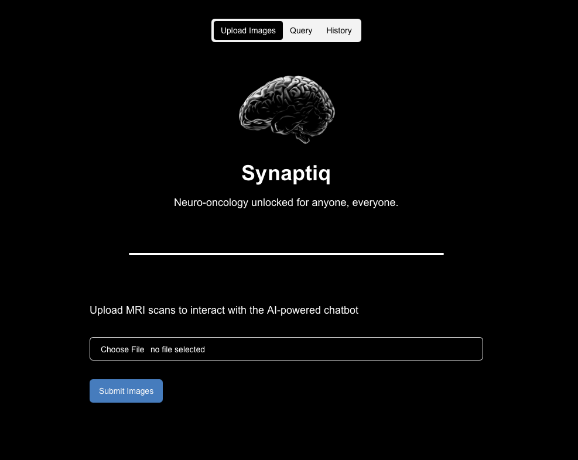
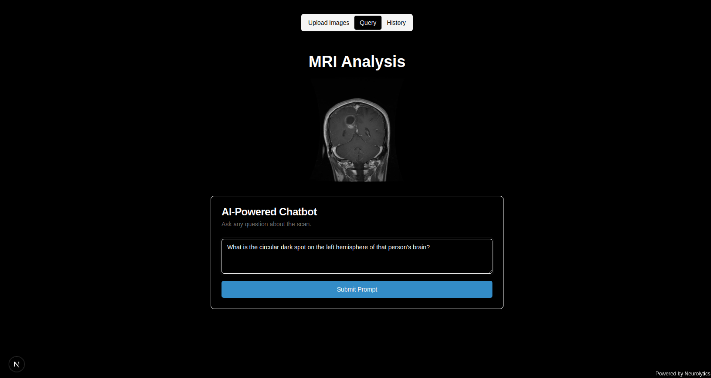
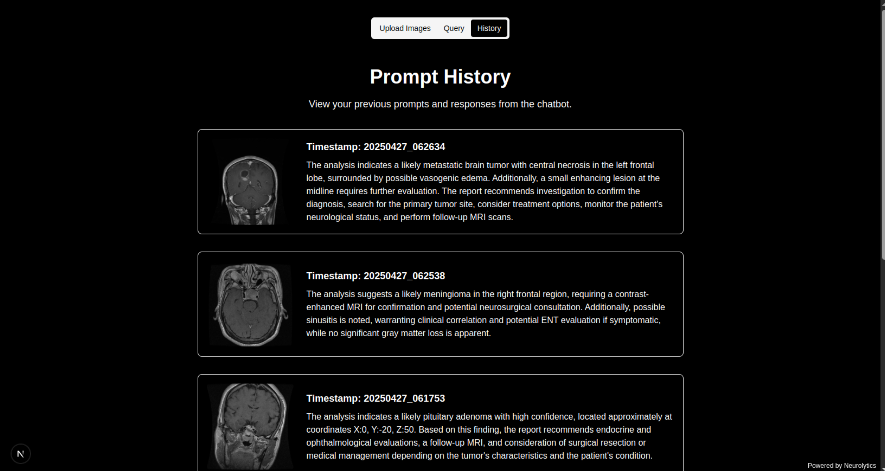

# 🧠 Synaptiq - AI-Powered Neurooncology Analysis

> **Neurooncology unlocked for anyone, everyone**

Synaptiq is an advanced web application that leverages AI to analyze brain MRI scans and provide medical insights. Built with a modern tech stack, it combines the power of Google's Gemini AI with a sophisticated 3D viewer to help medical professionals and researchers analyze brain scans for tumors, abnormalities, and other neurological conditions.



## ✨ Features

### 🏠 **Landing Page**
- Clean, professional interface with the Synaptiq logo
- Clear value proposition: "Neurooncology unlocked for anyone, everyone"
- Intuitive "Click to start" navigation

### 🔬 **AI-Powered MRI Analysis**
- Upload and analyze brain MRI scans using Google Gemini AI
- Automatic detection of brain tumors (glioma, meningioma, pituitary)
- Assessment of gray matter loss and abnormalities
- Precise tumor coordinate mapping (X, Y, Z coordinates)
- Detailed medical analysis and recommendations

### 💬 **Interactive AI Chatbot**
- Context-aware conversations about uploaded scans
- Medical AI assistant powered by Gemini
- Real-time responses to medical queries
- Integration with scan analysis results

### 📊 **3D Medical Viewer**
- Advanced 3D visualization of brain scans
- Tumor location highlighting with coordinates
- Interactive exploration of scan data
- Professional medical imaging interface

### 📚 **Conversation History**
- Complete history of all AI interactions
- Persistent storage of analysis results
- Easy access to previous consultations
- Export and review capabilities




## 🏗️ Architecture

### Frontend
- **Framework**: Next.js 15 with TypeScript
- **Styling**: Tailwind CSS with Radix UI components
- **AI Integration**: Google Genkit for AI workflows
- **Port**: 9003 (development)

### Backend
- **Framework**: Flask (Python)
- **AI Engine**: Google Gemini 1.5 Flash
- **Storage**: AWS S3 for file management
- **Port**: 5001 (development)

### Key Technologies
- **AI/ML**: Google Generative AI, scikit-learn, OpenCV
- **Medical Imaging**: PyDICOM, Napari, scikit-image
- **3D Visualization**: Custom viewer with medical imaging support
- **Cloud**: AWS S3 for scalable storage

## 🚀 Quick Start

### Prerequisites
- Node.js 18+ and npm
- Python 3.8+
- AWS Account with S3 bucket
- Google AI API key

### Environment Setup

1. **Clone the repository**
   ```bash
   git clone <repository-url>
   cd synaptiq
   ```

2. **Create environment file**
   ```bash
   # Create .env.local in the root directory
   GOOGLE_API_KEY=your_google_ai_api_key
   AWS_ACCESS_KEY=your_aws_access_key
   AWS_SECRET_KEY=your_aws_secret_key
   AWS_REGION=your_aws_region
   S3_BUCKET_NAME=your_s3_bucket_name
   ```

### Backend Setup

1. **Navigate to backend directory**
   ```bash
   cd backend
   ```

2. **Create virtual environment**
   ```bash
   python -m venv venv
   source venv/bin/activate  # On Windows: venv\Scripts\activate
   ```

3. **Install dependencies**
   ```bash
   pip install -r requirements.txt
   ```

4. **Start the Flask server**
   ```bash
   python app.py
   ```
   
   The backend will run on `http://localhost:5001`

### Frontend Setup

1. **Navigate to frontend directory**
   ```bash
   cd frontend
   ```

2. **Install dependencies**
   ```bash
   npm install
   ```

3. **Start the development server**
   ```bash
   npm run dev
   ```
   
   The frontend will run on `http://localhost:9003`

## 📖 Usage Guide

### 1. **Upload MRI Scans**
- Navigate to the upload page
- Drag and drop or select MRI scan files
- Supported formats: DICOM, JPEG, PNG
- Click "Submit" to begin analysis

### 2. **AI Analysis**
- The system automatically processes your scans
- Gemini AI analyzes for tumors, abnormalities, and conditions
- Results include precise coordinates and medical insights
- Analysis is stored securely in AWS S3

### 3. **Interactive Chat**
- Ask questions about your scans
- Get detailed medical explanations
- Request specific analysis of regions
- AI provides context-aware responses

### 4. **3D Visualization**
- Launch the 3D viewer for detailed exploration
- Navigate through scan slices
- View tumor locations with coordinates
- Professional medical imaging interface

### 5. **History Management**
- Access all previous analyses
- Review conversation history
- Export results for medical records
- Persistent storage of all interactions

## 🔧 API Endpoints

### Backend Routes
- `POST /analyze_mri` - Upload and analyze MRI scans
- `POST /chat` - AI chatbot interactions
- `GET /history` - Retrieve analysis history
- `POST /run-viewer` - Launch 3D medical viewer

### CORS Configuration
- Frontend origin: `http://localhost:9003`
- Backend origin: `http://localhost:5001`
- All origins allowed for development

## 🛠️ Development

### Project Structure
```
synaptiq/
├── backend/                 # Flask API server
│   ├── app.py              # Main Flask application
│   ├── viewer.py           # 3D medical viewer
│   ├── requirements.txt    # Python dependencies
│   └── scans/              # Sample DICOM files
├── frontend/               # Next.js application
│   ├── src/
│   │   ├── app/           # Next.js app router
│   │   ├── components/    # React components
│   │   ├── ai/           # AI integration
│   │   └── lib/          # Utilities
│   └── package.json
├── docs/                   # Documentation and images
└── .env.local             # Environment variables
```

### Available Scripts

**Frontend:**
- `npm run dev` - Start development server
- `npm run build` - Build for production
- `npm run lint` - Run ESLint
- `npm run typecheck` - TypeScript type checking

**Backend:**
- `python app.py` - Start Flask server
- `python viewer.py` - Launch 3D viewer directly

## 🔒 Security & Privacy

- **Secure API Keys**: Environment-based configuration
- **CORS Protection**: Properly configured cross-origin requests
- **File Validation**: Secure file upload handling
- **AWS Security**: S3 bucket with proper access controls
- **Medical Data**: HIPAA-compliant data handling practices

## 🤝 Contributing

1. Fork the repository
2. Create a feature branch (`git checkout -b feature/amazing-feature`)
3. Commit your changes (`git commit -m 'Add amazing feature'`)
4. Push to the branch (`git push origin feature/amazing-feature`)
5. Open a Pull Request

## 📄 License

This project is licensed under the MIT License - see the [LICENSE](LICENSE) file for details.

## 🆘 Support

For support and questions:
- Create an issue in the repository
- Check the documentation in the `docs/` folder
- Review the blueprint in `frontend/docs/blueprint.md`

## 🔮 Roadmap

- [ ] Multi-modal AI analysis (CT, PET scans)
- [ ] Real-time collaboration features
- [ ] Advanced 3D segmentation
- [ ] Mobile application
- [ ] Integration with PACS systems
- [ ] Machine learning model training interface

---

**Built with ❤️ for the medical community** 